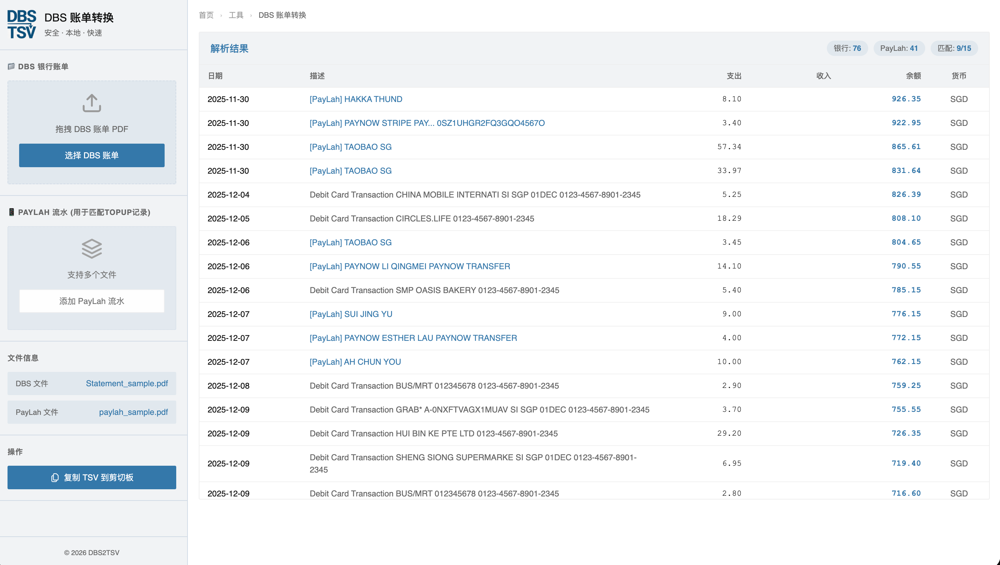

# DBS 银行账单 & PayLah! 流水转换工具

一个纯前端的 Web 应用，能够将 DBS 银行（新加坡）的 PDF 电子对账单转换为 TSV 格式，并智能匹配 PayLah! 流水，还原每一笔消费的真实去向。

🔗 **在线体验**: https://hills-dong.github.io/dbs2tsv/



## ✨ 核心特性

### 1. 🏦 DBS 账单深度解析
- **高精度解析**：基于坐标算法精确提取交易日期、描述、支出、收入和余额。
- **智能合并**：自动处理跨行描述，还原完整的交易信息。
- **安全隐私**：所有解析完全在浏览器本地完成，数据绝不上传服务器。

### 2. 📱 PayLah! 流水智能匹配 (Kill Feature)
DBS 账单中通常只显示笼统的 "TOP-UP TO PAYLAH"，无法知道钱具体花哪里了。本工具解决了这一痛点：
- **自动解析 PayLah 账单**：支持上传 PayLah! 的 PDF 电子账单。
- **智能关联**：自动通过**日期**和**金额**，将 DBS 中的充值记录替换为 PayLah 中的实际消费明细（如 "SHOPEE PAYMENT", "FOOD PANDA" 等）。
- **多文件支持**：支持批量上传多个月份的 PayLah 账单，系统会自动聚合。
- **自动去重**：自动识别重叠日期的交易记录，防止数据重复。
- **跨年处理**：根据 Statement Date 自动推断交易年份，完美处理跨年账单。

### 3. 🎨 极简主义设计 (Douban Style)
- **清爽界面**：致敬豆瓣的极简设计风格，白底蓝字，无干扰元素。
- **流畅交互**：支持拖拽上传，即时反馈解析状态。
- **一键导出**：解析结果为 TSV 格式，点击按钮即可直接复制到 Excel、Google Sheets 或 Notion。

## 🚀 快速开始

### 方法 1：直接打开（最快）
双击项目根目录下的 `index.html` 文件，在浏览器中直接运行。

### 方法 2：本地服务运行（推荐）
如果你安装了 Python 或 Node.js：

```bash
# Python 3
python3 -m http.server 8000

# Node.js
npx http-server -p 8000
```
访问：`http://localhost:8000`

## 📖 使用指南

1.  **上传 DBS 账单**
    - 将 DBS 银行的电子对账单（PDF）拖入左上角的蓝色上传区。
    - 系统会立即解析并展示基础交易。

2.  **上传 PayLah! 流水（可选，但强烈推荐）**
    - 将 PayLah! 的 PDF 账单拖入左下方的"PayLah 流水"区域。
    - 支持一次拖入多个文件，或分批上传。
    - 上传后，系统会自动运行匹配算法，刷新右侧表格，将 "TOP-UP" 记录替换为真实的商家名称。

3.  **导出数据**
    - 检查解析结果无误后，点击左侧栏底部的 **"复制TSV内容到剪切板"** 按钮。
    - 打开 Excel 或 Google Sheet，按下 `Cmd+V` (macOS) 或 `Ctrl+V` (Windows) 粘贴。

## 🔧 技术实现原理

### 1. 坐标系解析算法 (DBS)
由于 PDF 内部无表格结构，我们采用基于 `(X, Y)` 坐标的解析策略：
- **行识别**：按 Y 坐标聚类，识别每一行交易。
- **列映射**：
    - `x < 90`: 日期 (Date)
    - `90 ≤ x < 330`: 描述 (Description)
    - `330 ≤ x < 420`: 支出 (Debit)
    - `420 ≤ x < 500`: 收入 (Credit)
    - `x ≥ 500`: 余额 (Balance)

### 2. PayLah 匹配算法
- **归一化**：将 PayLah 和 DBS 的金额都转换为标准浮点数。
- **匹配条件**：
    - `PayLah.Date == DBS.Date`
    - `abs(PayLah.Amount - DBS.Debit) < 0.005` (处理浮点精度)
    - `PayLah.Type == 'DB'` (只匹配消费，不匹配入账)
- **策略**：优先匹配未被使用的 PayLah 记录，一旦匹配，该记录标记为 `Used`，防止重复匹配。

## 📁 项目结构
```
dbs2tsv/
├── index.html        # 应用主入口
├── app.js            # 核心业务逻辑 (解析、匹配、UI控制)
├── styles.css        # 样式文件 (Douban Style)
├── logo.png          # 应用图标
├── favicon.png       # 网站图标
├── requirements.md   # 技术需求文档
└── tests/            # 自动化测试套件
    ├── test-runner.js # 测试运行器
    └── ...
```

## 🧪 自动化测试
本项目包含完整的自动化测试套件，覆盖解析、去重和匹配逻辑。
运行测试：
```bash
node tests/test-runner.js
```

## 📝 许可证
MIT License. 仅供个人学习和财务管理使用。请注意保护个人隐私，不要将账单文件上传到公共网络。
